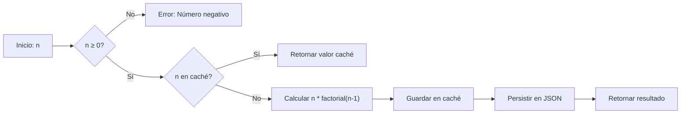

# Algoritmo de Factorial Optimizado con Memoización

**El factorial de un entero no negativo n (n!) se calcula recursivamente, pero con dos optimizaciones clave:**

- **Memoización:** Almacena resultados en memoria para evitar cálculos redundantes.
- **Caché Persistente:** Guarda resultados en un archivo JSON para reutilizarlos entre ejecuciones del programa.

## Optimización de Rendimiento

| Enfoque          | Complejidad Temporal (n=50)     | Caso de Uso        |
| ---------------- | ------------------------------- | ------------------ |
| Recursivo Simple | O(n)                            | Casos básicos      |
| Memoización      | O(1) después del primer cálculo | Cálculos repetidos |

## Diagrama de Flujo

---

🌟 **¿Te gustó este algoritmo?**
[Dame una estrella](https://github.com/bit-exploit/ts-essentials/stargazers)

🚀 **Siguiente paso:**
[Explorar más algoritmos →](/README.md)
