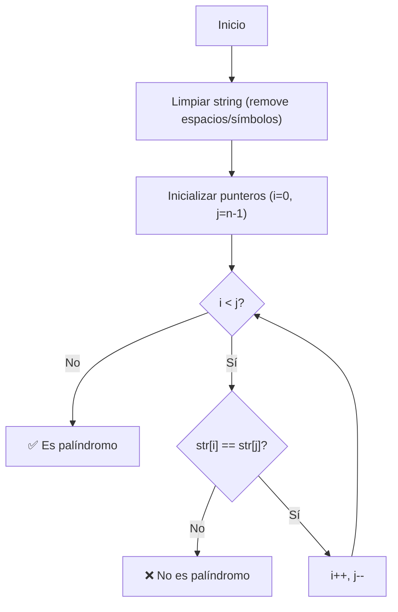

# Algoritmo de Palíndromo Optimizado con Múltiples Estrategias

**Un palíndromo es una palabra, frase o secuencia que se lee igual en ambas direcciones. Este algoritmo implementa tres enfoques diferentes:**

- **Comparación de Strings:** Versión básica usando métodos de array
- **Punteros:** Versión óptima en memoria (O(1) espacio adicional)
- **Stack:** Demostración con estructura de datos (fines educativos)

## Comparación de Rendimiento

| Enfoque     | Complejidad Temporal | Complejidad Espacial | Caso Ideal         |
| ----------- | -------------------- | -------------------- | ------------------ |
| Comparación | O(n)                 | O(n)                 | Código legible     |
| Punteros    | O(n)                 | O(1)                 | Strings muy largos |
| Stack       | O(n)                 | O(n/2)               | Aprendizaje        |

## Diagrama de Flujo (Versión Punteros)

---

🌟 **¿Te gustó este algoritmo?**
[Dame una estrella](https://github.com/bit-exploit/ts-essentials/stargazers)

🚀 **Siguiente paso:**
[Explorar más algoritmos →](/README.md)
